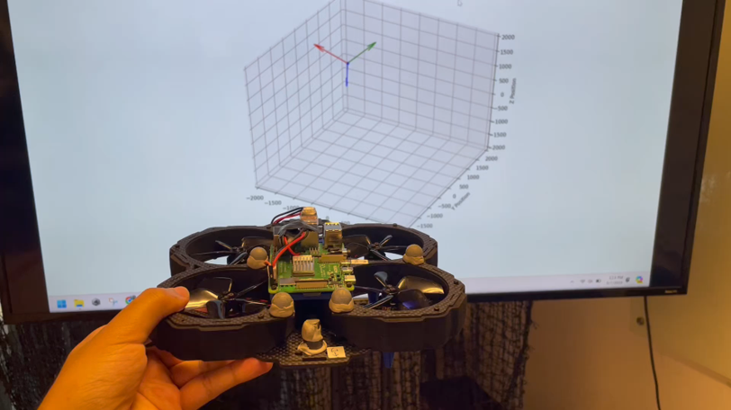
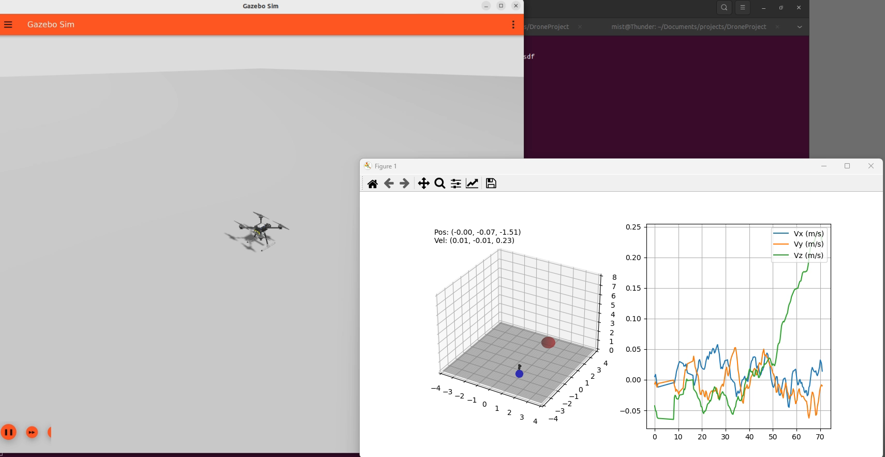

# Quadrotor Hardware Simulation and Trajectory Optimization

This repository houses the development and testing of control algorithms for a quadrotor running the PX4 flight controller. The simulation is carried out in ROS2 Gazebo, serving as a preliminary stage before deployment on actual hardware. The objective is to ensure the safety and efficiency of trajectories before they are implemented in a live environment.

## Development Phases

1. **Visualizer Tool**  
   To facilitate real-time monitoring and debugging, a visualizer tool (`vis.py`) has been developed. This tool provides dynamic visualization of the vehicle's attitude, helping to understand the system's state at every point during the simulation.

   

2. **Safety Layer Code**  
   The `offboard_safety_layer.py` script incorporates a critical safety layer that verifies command safety before execution. This layer acts as a safeguard, preventing the execution of commands that could lead to unsafe states or damage the vehicle.

3. **Trajectory Generation using SCVX**  
   Trajectory optimization is performed using a custom-written Sequential Convex Programming (SCVX) class (`scvx_class.py`). This class is tailored specifically for our application, providing a robust method for generating optimized trajectories that are both efficient and safe for the quadrotor.

   

## Simulation and Testing

The entire suite is tested in a controlled virtual environment using ROS2 Gazebo. This allows for detailed analysis and refinement of the algorithms, ensuring that they perform as expected under various conditions before actual deployment.

By following this rigorous testing regime, we aim to minimize risks and optimize performance for the real-world application of these advanced control strategies.
